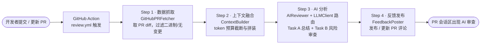

<!-- markdownlint-disable MD033 MD041 -->
<div align="center">

# 🤖 Autonomous-PR-Reviewer

**全自动 AI 代码评审工具 —— 开发者提交 PR，系统自动抓取代码变更、用大语言模型智能审查，并将结果自动回复到 PR 评论区。最终形态为开箱即用的 GitHub Action。**

</div>

---

## 📺 视频讲解（B 站）

> 🎬 **作品演示与讲解视频，请点击观看：**
>
> ### 👉 [在此处粘贴你的 Bilibili 视频链接](https://www.bilibili.com/)
>
> *（评委可通过此视频快速了解作品的设计思路与实际运行效果。）*

## 🚀 在线体验（零配置，打开即用）

> 无需登录、无需配置密钥，粘贴任意公开 GitHub PR 链接即可看到 AI 审查结果：
>
> ### 👉 [在此处粘贴你的 Hugging Face Spaces 在线体验链接](https://huggingface.co/spaces)

---

## ✨ 功能特性

| 能力 | 说明 |
|---|---|
| 🔄 **全自动闭环** | PR 打开 / 重开 / 推送新 commit 时自动触发，无需任何人工操作 |
| 🎯 **精准识别隐患** | 聚焦并发竞态、内存风险、逻辑错误、未处理的边界情况等**高风险**问题，并定位到文件与行号 |
| 🤫 **低误报** | 严格约束：没有严重问题时直接回复"未发现明显的高风险问题"，**绝不捏造或堆砌琐碎的风格建议** |
| 🧩 **多模型路由** | 抽象 LLM 客户端层，支持 OpenAI / DeepSeek / Gemini（openai 兼容）与 Claude（anthropic），按配置自动路由 |
| ✂️ **Token 预算控制** | 超长 diff 自动按「逐文件预算」截断融合，防止超出大模型 token 限制 |
| ♻️ **增量审查** | PR 多次推送时，仅审查自上次审查以来的**新增改动**（基于评论中记录的 head SHA），节省 token |
| 💬 **评论防刷屏** | 同一 PR 多次推送时，**原地更新同一条评论**而非反复新建（基于隐藏标记 upsert） |
| 🌐 **零配置 Web 体验** | 提供 Streamlit 在线体验端：粘贴公开 PR 链接即可看到 AI 审查，无需登录 / 配置密钥 |
| 🛡️ **工程化健壮** | 全程 `logging`、完整类型注解、防御性异常处理、内置重试；**46 个单元测试 + CI 守护主分支** |

---

## 🎬 演示效果

> 下列截图来自真实的一次自动审查（演示 PR 中故意埋入并发竞态与除零两处隐患）。

**① GitHub Action 自动运行（抓取 → 融合 → 审查 → 发布全流程）**


**② AI 自动发布的审查评论（精准抓出两处隐患并定位行号）**


**③ 单元测试与 CI（28 个用例全部通过）**


> 📌 *截图文件请放置于 [`docs/images/`](docs/images/) 目录，命名见该目录说明；具体复现步骤见 [测试计划](docs/TEST_PLAN.md)。*

---

## 🏗️ 架构与工作流

完整 Pipeline 分为四步，由编排器 `main.py` 串联，并由 GitHub Action 自动驱动：



---

## 🧩 模块说明

| 模块 | 职责 | 关键设计 |
|---|---|---|
| [`src/github_service.py`](src/github_service.py) | **Step 1** 抓取指定 PR 的文件 diff | 过滤二进制 / 无文本变更文件；支持按 `since_sha` 取增量（`repo.compare`）；`Auth.Token` 认证 |
| [`src/context_builder.py`](src/context_builder.py) | **Step 2** token 预算融合 / 截断 | 字符启发式估算；逐文件预算；超长截断 + 超预算省略并统计 |
| [`src/ai_reviewer.py`](src/ai_reviewer.py) | **Step 3** 调用 LLM 智能审查 | 双任务 Prompt（总结 + 低误报风险审查）；仅依赖 LLMClient 抽象，与厂商解耦 |
| [`src/llm_client.py`](src/llm_client.py) | **多模型路由** LLM 客户端抽象 | OpenAI 兼容 / Anthropic 双后端；按 `LLM_PROVIDER` 或模型名路由；统一异常与重试 |
| [`src/feedback_poster.py`](src/feedback_poster.py) | **Step 4** 发布审查评论 | Issue Comment；隐藏标记 upsert 防刷屏 + 记录已审查 SHA（供增量）；空内容拒发 |
| [`src/main.py`](src/main.py) | **编排器** 串联四步 | 目标按「命令行 > 环境变量」解析；统一兜底与退出码 |
| [`.github/workflows/review.yml`](.github/workflows/review.yml) | **GitHub Action** | `pull_request` 触发，自动运行编排器 |

---

## 🚀 快速开始

### 方式一：作为 GitHub Action 自动运行（推荐）

1. 将本项目代码放入目标仓库（或直接在本仓库使用）。
2. 在 **仓库 Settings → Secrets and variables → Actions** 配置：
   - **Secret** `LLM_API_KEY` —— 你的大模型 API Key（OpenAI 兼容厂商；Claude 用 `ANTHROPIC_API_KEY`）
   - **Variable** `LLM_BASE_URL` —— 接口地址，例如 Gemini：`https://generativelanguage.googleapis.com/v1beta/openai/`
   - **Variable** `LLM_MODEL` —— 模型 ID，例如 `gemini-2.5-flash`、`gpt-4o`、`claude-sonnet-4-6`
   - **Variable** `LLM_PROVIDER`（可选）—— `openai` / `anthropic`；留空则按模型名自动推断（`claude*` → anthropic）
   > `GITHUB_TOKEN` 由 Actions 自动提供，无需配置。
3. 之后任何人在该仓库**开 PR 或推送新 commit**，即自动触发审查并在 PR 下发布评论。

### 方式二：本地命令行运行

```bash
# 1. 创建并激活虚拟环境
python -m venv .venv
# Windows PowerShell:  .\.venv\Scripts\Activate.ps1
# Mac/Linux:           source .venv/bin/activate

# 2. 安装依赖（国内可加清华镜像：-i https://pypi.tuna.tsinghua.edu.cn/simple）
pip install -r requirements.txt

# 3. 配置环境变量：复制 .env.example 为 .env，填入 GITHUB_TOKEN / LLM_API_KEY / LLM_BASE_URL / LLM_MODEL

# 4. 运行（指定仓库与 PR 号）
python src/main.py --repo owner/repo --pr 1
```

### 方式三：本地启动 Web 体验端

```bash
# 配置好 .env 后启动 Streamlit（浏览器打开后粘贴公开 PR 链接即可）
streamlit run app.py
```

> 线上版本部署于 Hugging Face Spaces（见页面顶部「在线体验」链接），密钥通过 Space Secrets 注入，评委零配置即可使用。

---

## 🛠️ 技术栈与第三方依赖

> 本项目仅依赖以下开源库；**核心审查逻辑均为自研**（见下方「原创性说明」）。

| 依赖库 | 版本 | 用途 | 许可证 |
|---|---|---|---|
| [PyGithub](https://github.com/PyGithub/PyGithub) | 2.9.1 | 与 GitHub API 通信（抓取 PR diff、发布评论） | LGPL-3.0 |
| [openai](https://github.com/openai/openai-python) | 2.38.0 | 调用 OpenAI 兼容的大模型接口（OpenAI / DeepSeek / Gemini；含内置重试 / 规范化异常） | Apache-2.0 |
| [anthropic](https://github.com/anthropics/anthropic-sdk-python) | 0.105.2 | 调用 Anthropic（Claude）大模型接口（含内置重试 / 规范化异常） | MIT |
| [requests](https://requests.readthedocs.io/) | 2.32.5 | 通用 HTTP 请求支持 | Apache-2.0 |
| [python-dotenv](https://github.com/theskumar/python-dotenv) | 1.2.1 | 从 `.env` 加载环境变量（Token / API Key） | BSD-3-Clause |
| [streamlit](https://streamlit.io/) | ≥1.39 | Web 体验端（`app.py`）的纯 Python UI 框架 | Apache-2.0 |
| [pytest](https://pytest.org/) *(dev)* | 8.3.4 | 单元测试框架（仅开发 / CI 使用） | MIT |

- 运行时依赖见 [`requirements.txt`](requirements.txt)，开发依赖见 [`requirements-dev.txt`](requirements-dev.txt)。
- 语言与环境：**Python 3.10+**。

---

## 💡 原创性说明（自研部分）

为明确区分「调用第三方库」与「自研功能」，本项目以下逻辑均为**本次从零原创实现**，无复用任何历史代码或外部代码片段：

- **四步 Pipeline 的整体设计与编排**（`main.py` 的解析 / 串联 / 兜底逻辑）。
- **Step 2 上下文融合算法**：字符启发式 token 估算 + 逐文件预算 + 超长截断 / 超预算省略策略（`ContextBuilder`），非任何现成库提供。
- **Step 3 的 Prompt 工程**：双任务（变更总结 + 风险审查）设计，以及"低误报、无问题不强报、禁止琐碎建议"的约束。
- **Step 4 的评论 upsert 去重机制**：基于隐藏标记识别并原地更新机器人评论，避免刷屏。
- **多模型路由层**：`LLMClient` 抽象与 OpenAI 兼容 / Anthropic 双后端封装、按 `LLM_PROVIDER` 或模型名的路由策略、统一异常 `LLMError`（`llm_client.py`）。
- **增量审查机制**：用评论隐藏标记记录已审查 head SHA，下次仅审查 `since_sha..head` 的增量，含 force-push 回退全量的兜底。
- **Web 体验端**：基于 Streamlit 复用同一套 Pipeline，提供零配置在线试用（`app.py` + `pr_url.py` URL 解析）。
- **过滤、异常处理、日志、退出码** 等防御性工程逻辑。

第三方库仅用于其本职能力：`PyGithub` 提供 GitHub API 调用、`openai` / `anthropic` 提供各自 LLM 请求与重试、`python-dotenv` 提供配置加载、`requests` 提供 HTTP 基础能力。**审查"怎么做、做什么"的业务逻辑全部由本项目自行编写。**

---

## ✅ 测试与质量保障

- **单元测试**：共 **46 个用例**，覆盖四个核心模块 + 多模型路由 + 编排器 + URL 解析，全部使用 mock，**不依赖真实 Token / 网络**，可稳定在 CI 运行。
- **持续集成**：[`.github/workflows/ci.yml`](.github/workflows/ci.yml) 在每次 push 到 `main` 及任意 PR 时自动运行「语法编译检查 + pytest」，**保证主分支始终可运行**。
- **测试计划**：详见 [`docs/TEST_PLAN.md`](docs/TEST_PLAN.md)（含自动化测试清单与演示截图复现步骤）。

```bash
# 本地运行全部测试
pytest -v
```

---

## 📁 项目结构

```
LogicGuard-PR/
├── .github/workflows/
│   ├── ci.yml              # CI：编译检查 + 单元测试
│   └── review.yml          # GitHub Action：PR 自动审查
├── docs/
│   ├── images/             # README 演示截图
│   └── TEST_PLAN.md        # 测试计划
├── app.py                  # Web 体验端入口（Streamlit）
├── src/
│   ├── github_service.py   # Step 1 数据抓取
│   ├── context_builder.py  # Step 2 上下文融合
│   ├── ai_reviewer.py      # Step 3 AI 分析
│   ├── llm_client.py       # 多模型路由（OpenAI 兼容 / Anthropic）
│   ├── feedback_poster.py  # Step 4 反馈发布
│   ├── pr_url.py           # PR 链接解析（Web 端复用）
│   └── main.py             # 编排入口
├── tests/                  # 单元测试（46 个用例）
├── .env.example            # 环境变量模板
├── requirements.txt        # 运行时依赖
└── requirements-dev.txt    # 开发 / 测试依赖
```

---

## 🗺️ Roadmap

- [x] **多模型路由**：统一调度 OpenAI / DeepSeek / Gemini（openai 兼容）与 Claude（anthropic SDK），按需选模型。
- [ ] **行级评论（Review Comment）**：在具体代码行上给出建议（需可靠的行号定位）。
- [x] **增量审查**：仅审查相对上次的新增变更，进一步节省 token。

---

<div align="center">
<sub>本项目为 Hackathon 参赛作品，采用「每个 PR 只做一件事」的迭代方式开发，提交历史完整可追溯。</sub>
</div>
